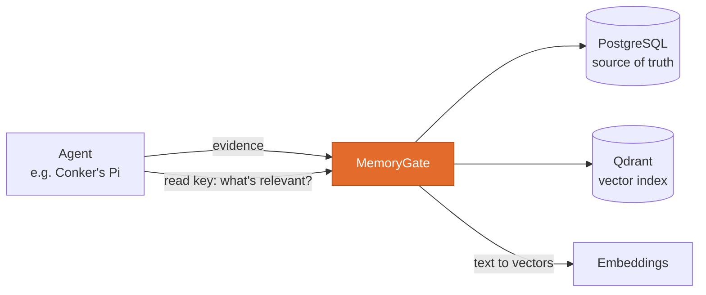
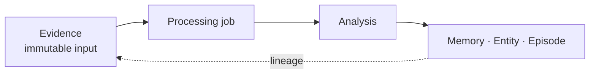

<p align="center"></p>
<h1 align="center">MemoryGate</h1>
<p align="center"><b>Memory for a personal AI agent, with every fact traceable to its source.</b><br/>
Evidence in, bounded context out. Nothing is silently overwritten.</p>
<p align="center">
  <a href="https://github.com/Conker-AI/memorygate/actions/workflows/ci.yml"></a>
  
  <a href="LICENSE"></a>
  <a href="https://github.com/Conker-AI/conker"></a>
</p>

MemoryGate is a self-hosted memory service for one personal agent. It receives evidence, keeps its
lineage, turns lasting signals into structured memory, and returns a small context package the
agent can use without touching a database.

It stores, retrieves and explains. It is not a chatbot and it never acts: the agent stays
responsible for reasoning and action. Part of [Conker](https://github.com/Conker-AI/conker), and
usable on its own.

## Where it fits



## How memory is built



| Layer | What it holds |
|---|---|
| **Evidence** | Raw inputs from conversations, listeners, APIs or manual capture. Never edited. |
| **Analysis** | A recorded interpretation of one or more pieces of evidence. |
| **Memory** | Durable facts, phases, context and watch items, ready for retrieval. |
| **Entity** | People, projects, places, concepts, habits and objects. |
| **Episode** | A time-bounded event grouping related evidence. |

Every object can be opened in the dashboard with its history, links and supporting evidence.

## Retrieval, and saying when it's degraded

PostgreSQL is the source of truth. Qdrant indexes meaning, using vectors from the
[Embeddings](https://github.com/Conker-AI/embeddings) service; word matching runs alongside so exact
names are never hidden by similarity ranking.

If Embeddings is unavailable, search falls back to word matching and says so. `/health` reports
`degraded` and names `embeddings`, and every result carries the `retrieval_path` that produced it.
Writes still succeed, and report when they could not be indexed.


## Quick start

Requires Docker with Compose.

```bash
docker network create conker_net          # once; shared with the other Conker services
cp .env.example .env
echo "MEMORYGATE_ADMIN_KEY=$(openssl rand -base64 24)" >> .env
docker compose up -d --build
```

| | |
|---|---|
| Dashboard | `http://localhost:8021` |
| API | `http://localhost:8020` |

Without an admin key the API refuses to start and names the fix. For meaning-based search, run
[Embeddings](https://github.com/Conker-AI/embeddings) on the same network and set `EMBEDDINGS_KEY`.
Then, in **Settings**, change the admin key and create one read key for your agent.

## Using it from an agent

Give the agent a **read key**, never the admin key.

```bash
python services/cli/memorygate.py context "What should I remember about this project?"
```

A read-only MCP configuration and agent skill live in `integrations/`. Raw events go in through a
listener with its own secret: `POST /runtime/listeners/{source_key}`.

## Security model, briefly

- No admin key, no start. There is no open fallback.
- Read keys can retrieve context and nothing else. Listener secrets can only ingest.
- Keys are stored as PBKDF2 hashes; failed attempts are rate-limited.
- Destructive resets need the admin key *and* the phrase `RESET MEMORY`, and take a backup first.
- Models used by MemoryGate get no write, delete, shell or tool ability.

Keep the dashboard and API on a private network. Full model: [security](docs/security.md).

## Development

```bash
cd services/api
pip install -r requirements.txt -r requirements-dev.txt
python -m pytest tests
```

The suite needs no running services: it uses a real SQLite database and aims its health probes at a
closed port, so the degraded paths run for real. More in [development](docs/development.md).

## Documentation

| | |
|---|---|
| [Security model](docs/security.md) | Keys, CORS, destructive actions, bootstrap |
| [Operations](docs/operations.md) | Ingestion, backups, resets, limits |
| [Dashboard](docs/dashboard.md) | Every screen, with screenshots |
| [AI runtime](docs/ai-runtime.md) | Which models MemoryGate may use, and for what |
| [Agent integration](docs/AGENT_INTEGRATION.md) | Connecting an agent |
| [Conversation memory](docs/conversation-memory.md) | Admission, retries and forgetting for Pi |
| [Development](docs/development.md) | Building, testing, layout |
| [API (OpenAPI)](docs/openapi.json) | Full route reference |

## License

[MIT](LICENSE)
